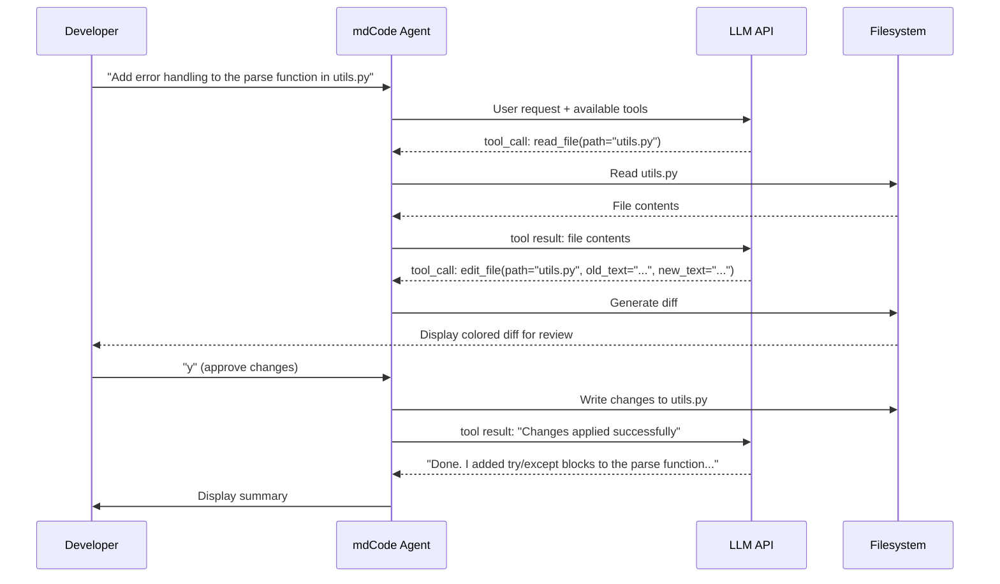
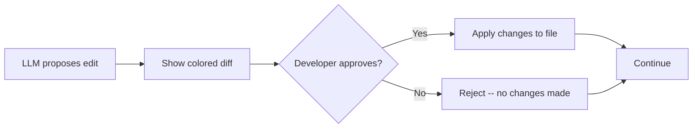

# Journal Club: LLM Fundamentals & Coding Agents

## 0. The AI Landscape in Early 2026

### OpenClaw

Imagine telling your computer, "Book me a flight to New York next Friday, find a hotel near 14 St, and add both to my calendar." **OpenClaw** is an open-source, self-hosted AI agent platform that can actually do that. It acts as a digital worker, managing email, calendars, and browsing. OpenClaw integrates with apps like WhatsApp, Slack, and Discord, utilizing LLMs to execute actions on a user's behalf. Originally created by Austrian developer Peter Steinberger, OpenClaw has racked up **343k stars on GitHub** as of March 2026, making it the fastest-growing open-source project in GitHub history.

### NemoClaw

Big companies loved what OpenClaw could do but worried about security. So in March 2026, **NVIDIA** released **NemoClaw**, an open-source layer on top of OpenClaw that adds enterprise-grade security controls.

### Cursor

**Cursor** is a GUI-first AI IDE built on top of VS Code. It lets developers write, edit, and debug code using natural language, and it can understand your entire project to suggest changes across multiple files at once. According to their official website, Cursor is now used by over **50,000 enterprises** and **64% of Fortune 500** companies.

### Claude Code

**Claude Code** is a CLI-first, fully autonomous coding agent built by Anthropic that lives right in your terminal. You can ask it things like "find the bug in my login page" or "add a dark mode to this app," and it will read your files, propose changes, and apply them after you approve. It launched in May 2025, and within six months it became the most popular AI coding tool, reaching roughly **$1 billion in annual revenue**. By February 2026 that number had grown to about **$2.5 billion**.

### Google Stitch

What if you could describe an app out loud and watch it appear on screen? That is exactly what **Google Stitch** does. Built by Google Labs, Stitch lets you speak, type, sketch, or upload an image, and it generates a polished user interface for web or mobile. For example, you could say "create a recipe app with a search bar and a favorites list" and get a working design in seconds. It is completely free, runs in your browser, and received a major voice-powered redesign on March 19, 2026.

### So What?

These products look like magic, but here is the surprising part: under the hood, they all rely on the same handful of building blocks that have been around for over two years. API calls to large language models, structured output, function calling, and an agent loop. That is exactly what we are going to talk about today.

---

## 1. LLM API Call

### The LLM Landscape

#### Top Coding Models (LLM Arena, 2026)

| Model | Provider | Architecture | License | Est. Total Parameters | Code Arena Score |
|-------|----------|-------------|---------|----------------------|-----------------|
| **Claude Opus 4.6** | Anthropic | Dense Transformer | Proprietary | ~2T (est.) | 1549 |
| **GPT 5.4 High** | OpenAI | MoE | Proprietary | ~2T (est.) | 1457 |
| **GLM 5** | Zhipu AI | Dense Transformer | Open Source | ~500B (est.) | 1445 |
| **Gemini 3.1 Pro Preview** | Google | MoE | Proprietary | ~1.5T (est.) | 1445 |

> **Note:** Proprietary model details are not officially published. Parameter estimates above are community approximations.

### How Much Memory Does It Take to Run a Model?

- Each parameter is a floating-point number stored in GPU memory
- Memory required = `number of parameters x bytes per parameter`

| Precision | Bytes per Param | 7B Model | 70B Model | 405B Model |
|-----------|----------------|----------|-----------|------------|
| FP32 (full) | 4 bytes | **28 GB** | 280 GB | 1,620 GB |
| FP16 / BF16 (half) | 2 bytes | **14 GB** | 140 GB | 810 GB |
| INT8 (8-bit) | 1 byte | **7 GB** | 70 GB | 405 GB |
| INT4 (4-bit) | 0.5 bytes | **3.5 GB** | 35 GB | ~203 GB |

**Quick math for a 7B model at full precision:**
```
7,000,000,000 params x 4 bytes = 28,000,000,000 bytes = 28 GB VRAM
```

### Quantization: Trading Precision for Accessibility

- **Quantization** reduces the number of bits used to represent each weight
- FP32 -> FP16 -> INT8 -> INT4: each step halves the memory
- Trade-off: lower precision = less memory, but potential quality degradation

- **Key takeaway:** running inference on your own hardware is hard due to memory requirements.

### Making Your First API Call

- Instead of running a model yourself, you send a **prompt** over HTTP and get back a **completion**

#### Minimal Python Example (OpenAI)

```python
from openai import OpenAI

client = OpenAI()  # reads OPENAI_API_KEY from environment

response = client.chat.completions.create(
    model="gpt-4o",
    messages=[
        {"role": "system", "content": "You are a helpful assistant."},
        {"role": "user", "content": "What is a transformer model?"},
    ],
)

print(response.choices[0].message.content)
```

- `system` message: sets the behavior/persona of the model
- `user` message: your actual question or instruction
- The response comes back as a structured object with the model's text in `.choices[0].message.content`

---

## 2. Structured Output

### The Problem with Unstructured Output

- When you use a chat interface (e.g., ChatGPT web), the model returns free-form text
- To use that output in code, you would need to:
  1. Copy-paste the response
  2. Manually parse or split it into sections
  3. Hope the format is consistent every time

**Example: extracting promotion details from a Calendar View:**

Imagine you hover over a promotion in the Calendar View plot and see details like group_name, start_date, and discount info. You want to recreate `calendar_compare.csv` from these details, so you paste the screenshot into ChatGPT:

```
You:     "Extract the promotion details from this Calendar View hovering window:
          [image]"
ChatGPT: "Here are the promotion details:
          The promotion group is called Product 6.
          It runs from Aug 1, 2025 to August 15, 2025.
          It offers a 20% discount...
          "
```

- For a web session, now you need to manually copy-paste each field into Excel to build `calendar_compare.csv`
- For API usage, if the model changes its phrasing, your parsing breaks
- -> This doesn't scale when you have dozens of promotions to extract

### What Is Structured Output?

- **Structured output** forces the model to respond in a specific, machine-readable format (e.g., JSON)
- You define a **schema**, and the model is **guaranteed** to follow it
- No more regex, no more copy-paste, no more broken parsing.

### Code Example with Pydantic + OpenAI

```python
from pydantic import BaseModel
from openai import OpenAI

# Define your schema using Pydantic
class Promotion(BaseModel):
    group_name: str
    start_date: str
    end_date: str
    discount: str
    promo_price: float

class PromotionList(BaseModel):
    promotions: list[Promotion]

client = OpenAI()

response = client.beta.chat.completions.parse(
    model="gpt-4o",
    messages=[
        {"role": "system", "content": "Extract promotion details from Calendar View screenshots."},
        {"role": "user", "content": [
            {"type": "text", "text": "Extract all promotion details from this Calendar View hovering window:"},
            {"type": "image_url", "image_url": {"url": ...}},
        ]},
    ],
    response_format=PromotionList,  # enforce this schema
)

result = response.choices[0].message.parsed  # already a PromotionList object
```

- The response is a **Python object**, not a string and no parsing needed
- Directly usable to build `calendar_compare.csv` with a few lines of code:

### How Does Structured Output Work Under the Hood?

- The model is **fine-tuned** to follow JSON schemas during training
- At inference time, the provider uses **constrained decoding** (also called grammar-guided generation):
  - At each token generation step, tokens that would violate the schema are masked out
  - The model can only produce tokens that lead to valid JSON matching your schema
- This is why it's **guaranteed**

### What About Pydantic?

- [Pydantic](https://docs.pydantic.dev/) is a Python library for data validation using type annotations
- OpenAI's SDK uses Pydantic models to define the expected response schema
- The SDK converts your Pydantic class into a JSON Schema, sends it to the API, and parses the response back into a Pydantic object

---

## 3. Function Calling

### LLMs Are Stateless

- Once trained, the model's **weights are frozen**, meaning they do not update at inference time
- The model has **no access to the outside world**: no internet, no files, no databases, no real-time data
- It can only work with what's in the current conversation context (the messages you send)

**Example of the limitation:**
```
You:     "What's the weather in San Mateo right now?"
Model:   "I don't have access to real-time weather data.
          As of my last training data..."
```

### What Is Function Calling?

- **Function calling** lets you give the model a set of **tools** (functions) it can choose to invoke
- The model doesn't execute the function itself. It returns a **structured request** saying "please call this function with these arguments"
- Your code executes the function and sends the result back to the model

### How the Function Calling Pipeline Works


> Source: [OpenAI Function Calling Guide](https://developers.openai.com/api/docs/guides/function-calling)

### How Does the Model Know Which Tool to Call?

- **Tool definitions in context**: when you pass `tools=[...]`, the API serializes those tool schemas and injects them into the model's context (similar to a system prompt)
- The model sees the name, description, and parameter schema of every available tool
- **Training**: the model is fine-tuned on thousands of examples where:
  - A user asks a question
  - The correct response is a `tool_call` with the right function name and arguments
  - The model learns to match user intent to the appropriate tool
- **Selection logic at inference**:
  1. Model reads the user message and all available tool schemas
  2. It decides: "Can I answer this directly, or do I need a tool?"
  3. If a tool is needed, it generates a structured `tool_call` (function name + JSON arguments)
  4. If multiple tools are available, it picks the most relevant one based on the description match and parameter fit

### Key Takeaways

- The model **does not execute** any code. Your application does
- The model **does not have access** to your functions. It only sees the JSON Schema descriptions you provide
- Function calling turns the LLM into a **reasoning + routing layer** that decides what to do, while your code does the actual work

---

## 4. Example Coding Agent - MDCode

### Why a Web Chat Session Isn't Enough

- In a web session (ChatGPT, Claude.ai), you would:
  1. Copy your code and paste it into the chat
  2. Ask the model to modify it
  3. Copy the model's output back into your editor
  4. Repeat for every file and every change
- This is **tedious, error-prone, no customization, and doesn't scale** for real codebases

### Coding Agent = LLM + tools

- A **coding agent** = LLM + tools that interact with the filesystem
- The agent needs at minimum:
  - `read_file`: see what's currently in a file
  - `edit_file`: modify specific parts of a file (with diff review)
  - `write_file`: create new files when needed

### How mdCode Works (Our Coding Agent)

The `mdCode.py` file in this repo implements a minimal coding agent using OpenAI's function calling:

```python
# The three tools registered with the LLM
TOOLS = [
    {"type": "function", "function": {"name": "read_file", ...}},
    {"type": "function", "function": {"name": "write_file", ...}},
    {"type": "function", "function": {"name": "edit_file", ...}},
]

# The agent loop: send message → check for tool calls → execute → repeat
while True:
    response = client.chat.completions.create(
        model="gpt-4o", messages=messages, tools=TOOLS,
    )
    if response has tool_calls:
        execute each tool, append results, loop again
    else:
        print the final response, break
```

### Agent Pipeline: What Happens When You Ask It to Modify Code



- The loop continues until the model decides it's done and returns a text response instead of a tool call
- The model can chain multiple tool calls: read a file, then edit it, then read another file, etc.
- Each tool call result is appended to the conversation, so the model has full context of what it's done

### Human in the Loop: Why It Matters

- The `edit_file` tool in mdCode **always shows a diff and asks for approval** before applying changes
- This is a critical safety mechanism:
  - LLMs can hallucinate or misunderstand the request
  - A wrong edit to production code can have serious consequences
  - The developer remains the **final decision maker**



- **Principle**: the agent suggests, the human decides
- This is how production-grade tools like Claude Code, Cursor, and GitHub Copilot work
